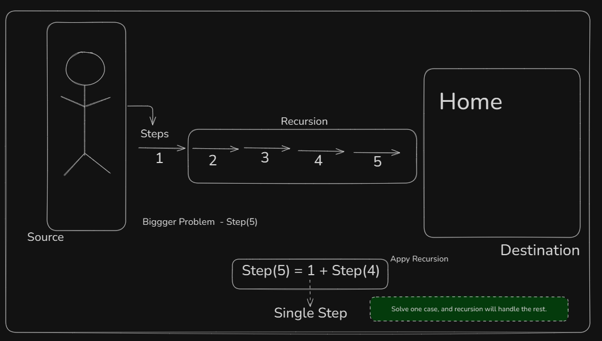
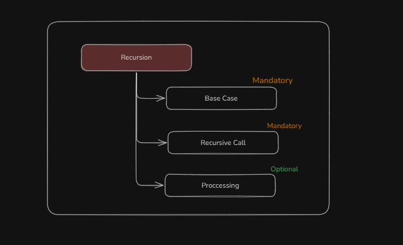

# Recursion

---

When a function call its self directly/indirectly.

If the solution to a larger problem depends on the solution to a smaller problem of the same type, we can apply recursion.



```
solve(n) - 2^n find

     solve(n) = 2*2^n-1
     solve(n) = 2*solve(n-1)
```

```
Factorial
      5! = 5*4*3*2*1

      solve(5) = 5!
      solve(5) = 5*4*3*2*1
      solve(5) = 5*4!

      solve(5) = 5*solve(4)
```


