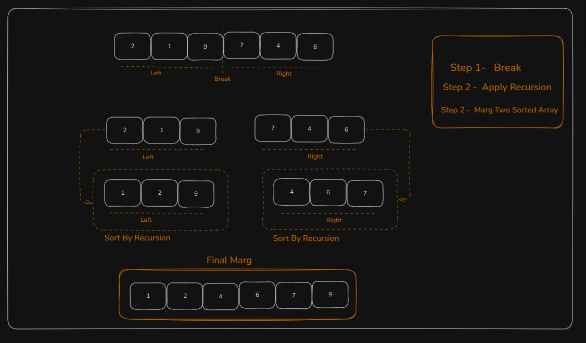

## Divide and Conquer

Divide and Conquer is an algorithmic technique that solves a problem by breaking it down into smaller subproblems.

This technique mainly follows three steps:

- **Divide:** Break the problem into smaller subproblems.
- **Conquer:** Solve these subproblems recursively.
- **Combine:** Combine the solutions of the subproblems to form the final solution

### Merge Sort is a classic example of the Divide and Conquer technique.



```jsx
function merge(arr, start, end) {
  let mid = Math.floor((start + end) / 2);

  let leftLength = mid - start + 1;
  let rightLength = end - mid;

  let left = new Array(leftLength);
  let right = new Array(rightLength);

  let k = start;
  for (let i = 0; i < leftLength; i++) {
    left[i] = arr[k];
    k++;
  }

  k = mid + 1;
  for (let i = 0; i < rightLength; i++) {
    right[i] = arr[k];
    k++;
  }

  let leftIndex = 0;
  let rightIndex = 0;
  let mainArrayIndex = start;

  while (leftIndex < leftLength && rightIndex < rightLength) {
    if (left[leftIndex] < right[rightIndex]) {
      arr[mainArrayIndex] = left[leftIndex];
      leftIndex++;
    } else {
      arr[mainArrayIndex] = right[rightIndex];
      rightIndex++;
    }
    mainArrayIndex++;
  }

  while (leftIndex < leftLength) {
    arr[mainArrayIndex] = left[leftIndex];
    leftIndex++;
    mainArrayIndex++;
  }

  while (rightIndex < rightLength) {
    arr[mainArrayIndex] = right[rightIndex];
    rightIndex++;
    mainArrayIndex++;
  }
}

function mergeSort(arr, start, end) {
  if (start >= end) {
    return;
  }

  let mid = Math.floor((start + end) / 2);

  mergeSort(arr, start, mid);
  mergeSort(arr, mid + 1, end);

  merge(arr, start, end);
}

let arr = [2, 1, 6, 9, 4, 5];

console.log("Before sorting:", arr);

mergeSort(arr, 0, arr.length - 1);

console.log("After sorting:", arr);
```

```cpp
#include <bits/stdc++.h>
using namespace std;

void merge(int arr[], int start, int end) {
  int mid = (start + end) / 2;


  int leftLength = mid - start + 1;
  int rightLength = end - mid;

// create left and right array
  int left[leftLength];
  int right[rightLength];

  // copy elements from original array to left array
  int k = start;
  for (int i = 0; i < leftLength; i++) {
      left[i] = arr[k];
      k++;
  }

   // copy elements from original array to right array
   k = mid + 1;
  for (int i = 0; i < rightLength; i++) {
      right[i] = arr[k];
      k++;
  }

   // merge sorted left and right array
  int leftIndex = 0;
  int rightIndex = 0;
  int mainArrayIndex = start;

  while (leftIndex < leftLength && rightIndex < rightLength) {
      if (left[leftIndex] < right[rightIndex]) {
          arr[mainArrayIndex] = left[leftIndex];
          leftIndex++;
          mainArrayIndex++;
      } else {
          arr[mainArrayIndex] = right[rightIndex];
          rightIndex++;
          mainArrayIndex++;
      }
  }

   // case 1: left array exhausted but right array has elements
   while (rightIndex < rightLength) {
    arr[mainArrayIndex] = right[rightIndex];
    rightIndex++;
    mainArrayIndex++;
  }

  // case 2: right array exhausted but left array has elements
  while (leftIndex < leftLength) {
    arr[mainArrayIndex] = left[leftIndex];
    leftIndex++;
    mainArrayIndex++;
  }

}

void mergeSort(int arr[], int start, int end) {
  if (start > end) {  // Invalid input
    return;
  }

  if (start == end) { // Single element
    return;
  }

   // Break the array
  int mid = (start + end) / 2;

  // recursive calls for left array
  mergeSort(arr, start, mid);

  // recursive calls for right array
  mergeSort(arr, mid + 1, end);

  merge(arr, start, end);
}

int main() {
  int arr[] = {2, 1, 6, 9, 4, 5};
  int size = 6;
  int start = 0;
  int end = size - 1;

  cout << "Before sorting: ";
  for (int i = 0; i < size; i++) {
      cout << arr[i] << " ";
  }
  cout << endl;

  mergeSort(arr, start, end);

  cout << "After sorting: ";
  for (int i = 0; i < size; i++) {
      cout << arr[i] << " ";
  }
  cout << endl;

return 0;
};
```
