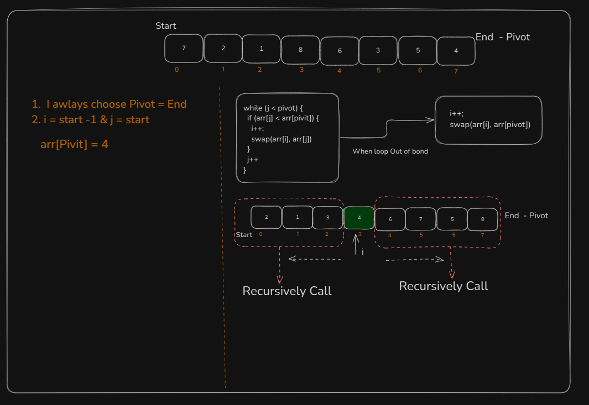

## Quick Sort

Quick Sort is a **divide-and-conquer** sorting algorithm

- **Choose a Pivot** – Pick a pivot element (e.g., first element, last element, random element, or median).
- **Partition the Array** – Rearrange elements so that:
  - Elements **smaller** than the pivot are placed to the left.
  - Elements **greater** than the pivot are placed to the right.
- **Recursively Apply QuickSort** – Apply the same process to the left and right subarrays.

```
Step 1:  Choose Pivot
Step 2: To place pivot such that
                                 - the elements To the right of pivot > arr[pivot]
                                 - the elementsTo the left of pivot < arr[pivot]

```


