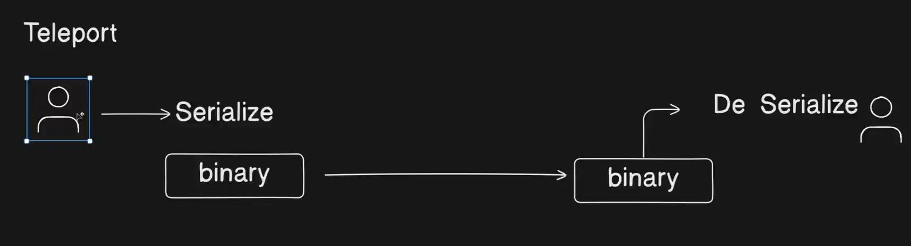

# Objects in JavaScript

---

## Data Structures

1. Primitive
2. Non Primitive

### Primitive Data Structure

Primitive data structures are those that a language supports out of the box.

For Example:

- Arrays → Build in JavaScript, Store data in Sequential form
- Objects

### Non-Primitive

Custom data structure

For Example:

- Linked List
- Graph
- Stack

## Objects

Objects is a data structure

It is a way to store data in memory in `Key Value` Pair form

### Creation

1. Using Object Literals

```jsx
const person = {
  // non singleton Object
  id: "1",
  firstname: "Sandeep",
  lastname: "Patel",
  techStack: ["HTML", "CSS", "JS"],
  student: true,
  getFullName: function () {
    return this.firstname + " " + this.lastname;
  },
  address: {
    city: "Pune",
    state: "Maharashtra",
    country: "India",
  },
};
```

2. Using the `Object` Constructor

```jsx
const person = new Object(); // singleton Object
person.name = "John";
person.age = 25;
```

3. Using `Object.create()`

create a new object with a specified prototype. It allows you to set up prototype inheritance cleanly.

```jsx
// Syntax

Object.create(proto, propertiesObject[Optional)
```

- `proto`: The object to be used as the prototype.
- `propertiesObject` _(optional)_: An object defining additional properties.

```jsx
// Define an object 'person' with a method 'greet'
const person = {
  greet: function () {
    console.log(`Hello, my name is ${this.name}`);
  },
};

// Create a new object 'john' that inherits[Extends] from 'person'
const john = Object.create(person);

// Add a 'name' property to 'john'
john.name = "John";

// Call the 'greet' method, which is inherited from 'person'
john.greet(); // Output: Hello, my name is John
```

4. Using a Constructor Function

```jsx
// Constructor function for a Person
function Person(name) {
  this.name = name;
}

// Adding a method to the prototype
Person.prototype.greet = function () {
  console.log(`Hello, my name is ${this.name}`);
};

// Creating instances
const john = new Person("John");
const jane = new Person("Jane");

// Calling methods
john.greet(); // Output: Hello, my name is John
jane.greet(); // Output: Hello, my name is Jane
```

5. Using ES6 Classes

```jsx
// Define a Person class
class Person {
  constructor(name) {
    this.name = name;
  }

  // Method inside the class
  greet() {
    console.log(`Hello, my name is ${this.name}`);
  }
}

// Creating instances
const john = new Person("John");
const jane = new Person("Jane");

// Calling methods
john.greet(); // Output: Hello, my name is John
jane.greet(); // Output: Hello, my name is Jane
```

### Accessing

```jsx
console.log("Person details: ", person);
console.log("Person id: ", person.id);
console.log("Person name: ", person.firstname + " " + person.lastname);
console.log("Person techStack: ", person.techStack);
console.log("Person is student: ", person.student);
console.log("Person full name: ", person.getFullName());
console.log("Person address: ", person.address);
```

```
OUTPUT:
Person details:  {
  id: '1',
  firstname: 'Sandeep',
  lastname: 'Patel',
  techStack: [ 'HTML', 'CSS', 'JS' ],
  student: true,
  getFullName: [Function: getFullName],
  address: { city: 'Pune', state: 'Maharashtra', country: 'India' }
}
Person id:  1
Person name:  Sandeep Patel
Person techStack:  [ 'HTML', 'CSS', 'JS' ]
Person is student:  true
Person full name:  Sandeep Patel
Person address:  { city: 'Pune', state: 'Maharashtra', country: 'India' }
```

### Adding Properties

You can add properties using **dot notation (`.`)** or **bracket notation (`[]`)**.

```jsx
const person = { name: "John" };

// Adding a new property
person.age = 30;
person["city"] = "New York";

console.log(person); // Output: { name: "John", age: 30, city: "New York" }
```

### Deleting Properties

You can delete properties using the **`delete`** keyword.

```jsx
const person = { name: "John" };

// Adding a new property
person.age = 30;
person["city"] = "New York";

delete person.age;

console.log(person); // Output: { name: "John", city: "New York" }
```

## Memory

### Stack Memory

- Primitive types (such as `number, string, boolean, null, undefined, symbol, and bigint`) are stored in stack memory
- Execution is fast because stack memory has a fixed size.
- It follows the LIFO (Last In, First Out) principle.
- When a function executes, its local variables are stored in the stack, and once the function execution is complete, they are removed from the stack.

```jsx
--------------------------------------------------
|                  Stack Memory                  |
--------------------------------------------------
| b -> 20                                        |
| a -> 10                                        |
--------------------------------------------------

let a = 10;  // Primitive type (Stack)
let b = a;   // `b` ko `a` ka copy milta hai
b = 20;      // `b` change hota hai, but `a` same rehta hai

console.log(a); // 10
console.log(b); // 20
```

### Heap Memory

- Objects and reference(Non-Primitive) types (such as `arrays, functions, objects, heap, graph, tree` ) are stored in heap memory.
- Heap memory has a dynamic size, which makes it slower compared to stack memory.
- When an object is created, memory is allocated in the heap, and its reference is stored in stack memory.
- **Garbage Collector (GC)** **unused objects ko clean** karta hai jo kisi bhi reference se accessible nahi hote in JS.

```jsx
--------------------------------------------------
|                  Stack Memory                  |
--------------------------------------------------
| obj1 -> (Heap Ref: 0x1)                        |
| obj2 -> (Heap Ref: 0x1)                        |
--------------------------------------------------

--------------------------------------------------
|                  Heap Memory                   |
--------------------------------------------------
| (0x1) -> { name: "Amit" }                      |
--------------------------------------------------

let obj1 = { name: "Rahul" };  // Heap me allocate hota hai
let obj2 = obj1;  // Stack me reference copy hota hai (Heap ka address)
obj2.name = "Amit";  // Heap me change hone se dono references pe effect

console.log(obj1.name); // "Amit"
console.log(obj2.name); // "Amit"
```

### **Memory Leak**

Jab program **memory allocate** karta hai (Heap me), par baad me us memory ko **free nahi karta** (ya **us tak koi access nahi hai**), to usko **Memory Leak** kehte hain.

### How to Copy Objects in JS

When we want to copy an object, there are two ways

1. Shallow Copy
2. Deep Copy

### Shallow Copy

Shallow copy sirf **top-level properties copy** karta hai, par agar object ke andar koi **nested object** ho, to wo **reference copy** hota hai.

Method 1: `Object.assign()`

```jsx
let obj1 = { name: "Rahul", age: 25 };
let obj2 = Object.assign({}, obj1);

obj2.age = 30; // Change `obj2` only
console.log(obj1.age); // 25 (No effect on obj1)
console.log(obj2.age); // 30
```

Method 2: Spread Operator `{ ... }`

```jsx
let obj1 = { name: "Rahul", age: 25 };
let obj2 = { ...obj1 };

obj2.name = "Amit"; // Change in `obj2`
console.log(obj1.name); // "Rahul" (No effect on obj1)
console.log(obj2.name); // "Amit"

--------------------------------------------------
|                 Stack Memory                   |
--------------------------------------------------
| obj1 -> (Heap Ref: 0x1)                        |
| obj2 -> (Heap Ref: 0x1)   <-- SAME REFERENCE   |
--------------------------------------------------

--------------------------------------------------
|                 Heap Memory                    |
--------------------------------------------------
| (0x1) -> { name: "Amit", details: { age: 30 } }|
--------------------------------------------------
```

### Deep Copy

Agar object me **nested objects** ho, aur unko bhi independent copy chahiye, to **Deep Copy** karni padegi.

Method : `JSON.parse(JSON.stringify(obj))`

```jsx
let obj1 = { name: "Rahul", details: { age: 25, city: "Delhi" } };
let obj2 = JSON.parse(JSON.stringify(obj1));

obj2.details.age = 30; // Change in obj2
console.log(obj1.details.age); // 25 (No effect on obj1)
console.log(obj2.details.age); // 30

--------------------------------------------------
|                 Stack Memory                   |
--------------------------------------------------
| obj1 -> (Heap Ref: 0x1)                        |
| obj2 -> (Heap Ref: 0x2)   <-- NEW REFERENCE    |
--------------------------------------------------

--------------------------------------------------
|                 Heap Memory                    |
--------------------------------------------------
| (0x1) -> { name: "Rahul", details: { age: 25 } } |
| (0x2) -> { name: "Rahul", details: { age: 30 } } |
--------------------------------------------------
```

### Serialization


